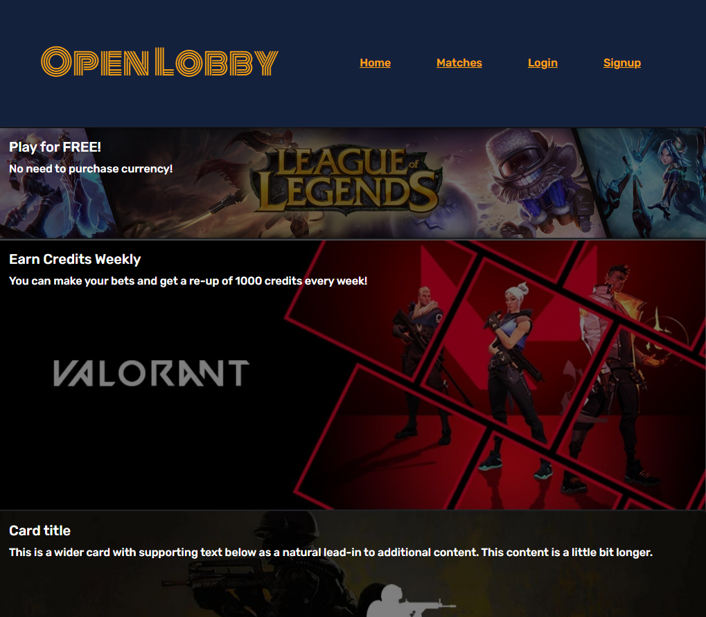

# open-lobby

Open Lobby is a full stack web application where fans of esports can place bets on their favorite teams.  It takes the broad and vast world of esports into a concise, easy to use site.  There is also a social element to it as each user will have a profile where they can see their open bets and how they have been doing. 

## Technologies Used

### Back End
Pandascore

### Front End
React Bootstrap and Google Fonts

## Screenshots
### Home Page

### Login Page

### Prediction Page

### Profile Page

## Deployed Application
https://gitgud-open-lobby.herokuapp.com/  

## Link to Repository
https://github.com/mrmrc182/esports-betting 